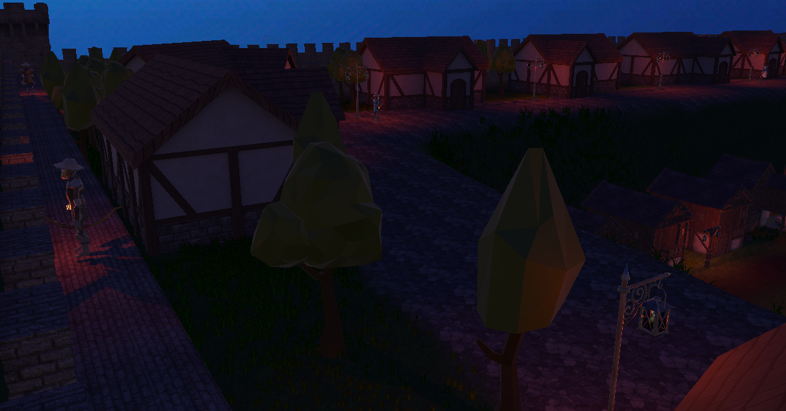
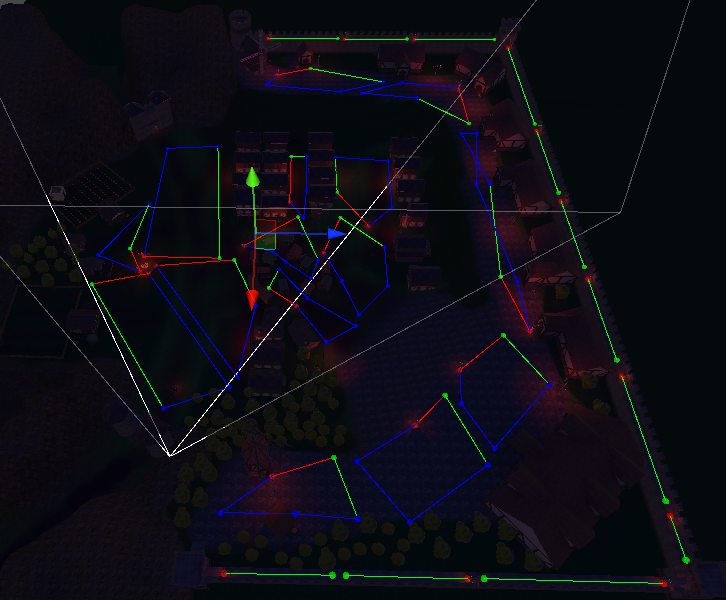
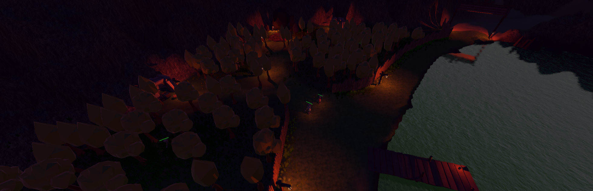

# Core-RPG-System
A point and click 3rd person/ isometric RPG. With some inspiration in Diablo, Torchlight, Mu etc. 

Reproduced some of the core mechanics of this genre like:
- Saving System, 
- Multiple weapons with different behaviors,
- 3D Movement(Navmesh) and Animations, 
- Cinematic(Cinemachine) System,
- Combat System,
- Attribute and Progression Systems,
- Multiple Cursors Indicators,
- 3D sounds,
- Enemy Patrol Routes and Guard Behaviors.

Experimented with:
- AI algorithms, 
- Shader Graph, 
- Cinemachine, 
- Environment Creation,
- Scene loading and transitions,
- Lighting.

**Castle:** 

**Water:** 

**Forest:** 

**Combat:** 
