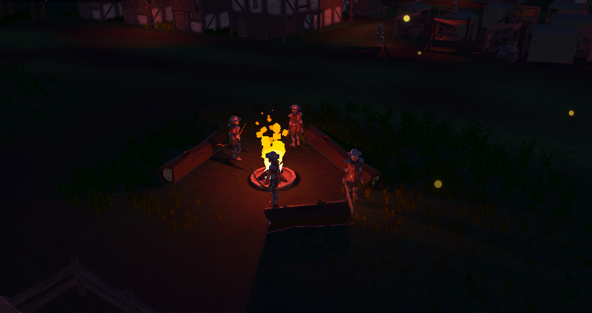

# Core-RPG-System
A point and click 3rd person/ isometric RPG. With some inspiration in Diablo, Torchlight, Mu etc. 

Reproduced some of the core mechanics of this genre like:
- saving system, 
- item drop and equip, 
- varied weapons and effects,
- 3D movement and animations, 
- cinematic system
- combat system.

Experimented with:
- AI algorithms, 
- Shader Graph, 
- Cinemachine, 
- Environment Creation.

**Stage 01 - Enemy Camp:** 

**Water:** 

**Combat:** 
